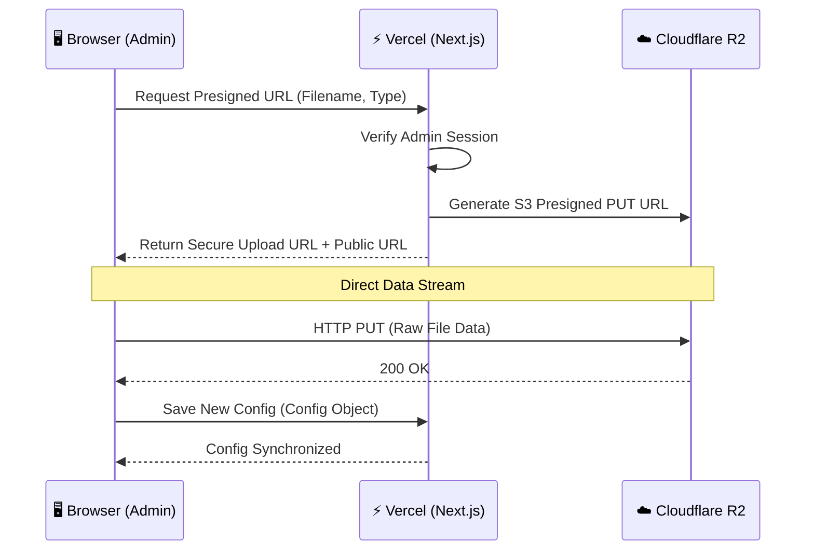

# ☁️  Cloudflare R2 Asset Management System

This document outlines the high-performance asset storage architecture implemented for **avrxt.in**, migrating from Supabase Storage to Cloudflare R2 for better latency, cost-efficiency, and edge delivery.

---

## 🏗️ Architecture Overview

The system uses a **Hybrid Edge-Auth Flow**. Authentication is handled on the server, while the actual data transfer happens directly between the Client and Cloudflare's Edge, bypassing Vercel's serverless function limitations.

---

## 🚀 Key Features

### 1. Direct-to-Cloud Uploads (Bypassing Vercel Limits)
Vercel has a hard 4.5MB limit on request bodies. To support large **4K videos (50MB+)**, we implemented **S3 Presigned URLs**. The browser uploads high-resolution media directly to Cloudflare R2, ensuring 100% reliability for large assets.

### 2. Intelligent Folder Hierarchy
Assets are automatically routed to global edge CDN paths:
- **Images**: `/i/` mapped to `i.cdn.avrxt.in`
- **Videos/Audio**: `/v/` mapped to `v.cdn.avrxt.in`

### 3. Automated Zero-Waste Storage
When a user updates a profile picture, banner, or music track:
- The system identifies the **Old Asset URL**.
- Automatically triggers a delete command to R2 via Server Actions.
- Ensures no "ghost files" accumulate in the bucket.

### 4. Interactive Purge Protocol
In the `/me/admin` gallery, deleting an item doesn't just remove it from the UI; it invokes the `deleteFromR2Action`, permanently wiping the binary from the cloud to keep storage lean.

---

## 🛠️ Technical Fixes & Optimizations

### 🛂 CORS Configuration
To allow the browser to talk to Cloudflare, the following CORS policy is applied:
- **Allowed Origins**: `www.avrxt.in`, `preview.avrxt.space`, `localhost:3000`
- **Allowed Methods**: `PUT, GET, POST, DELETE, HEAD`
- **Allowed Headers**: `*` (Support for `x-amz` checksums)

### ⚡ Performance Tuning
- **Region**: `auto` (Routes to the nearest Cloudflare data center).
- **TTL**: Presigned URLs are valid for **3600 seconds** (1 hour).
- **MIME Fallback**: Implemented `application/octet-stream` fallbacks to prevent AWS-SDK signature mismatches on files without clear metadata.

---

## ⚙️ Environment Configuration

| Variable | Usage |
|--- |--- |
| `R2_ENDPOINT` | Cloudflare R2 S3 API Endpoint |
| `R2_ACCESS_KEY_ID` | API Access Key |
| `R2_SECRET_ACCESS_KEY` | API Secret Key |
| `NEXT_PUBLIC_R2_IMAGE_DOMAIN` | `i.cdn.avrxt.in` |
| `NEXT_PUBLIC_R2_VIDEO_DOMAIN` | `v.cdn.avrxt.in` |

---

*Last Refactored: March 3, 2026 by Vipin R*
