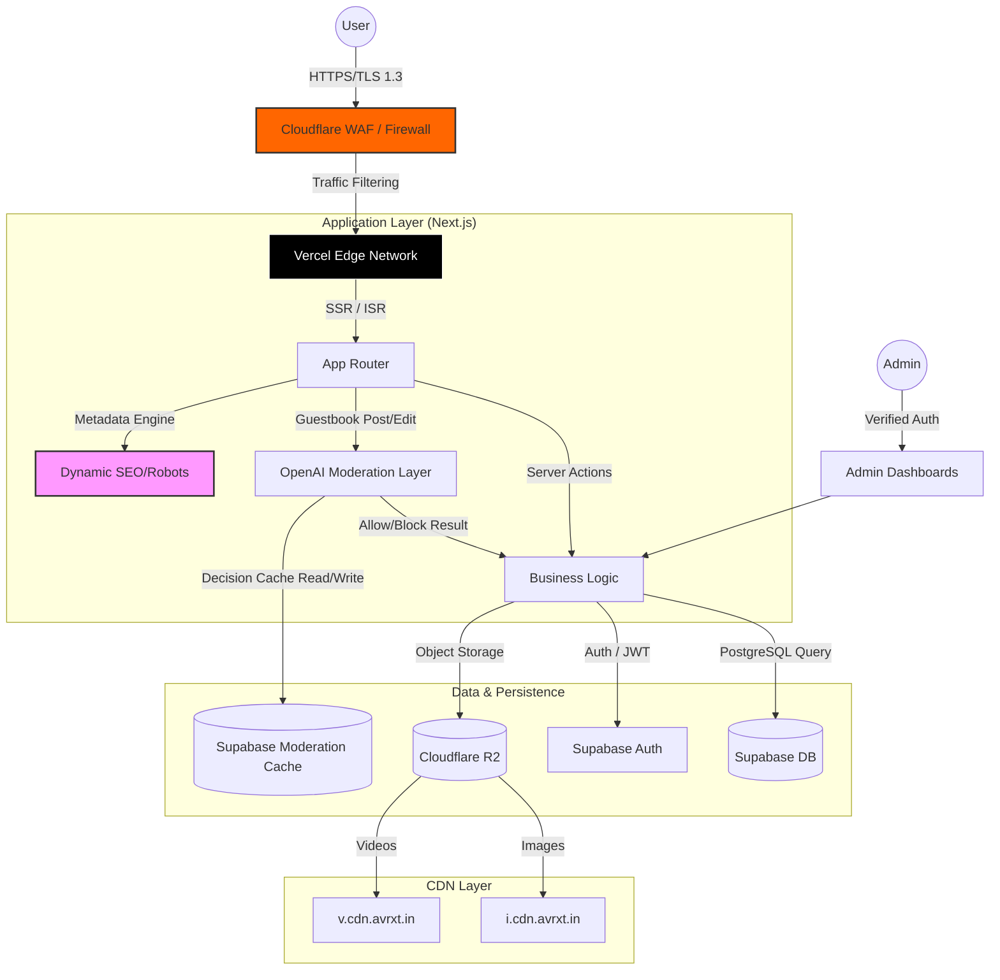
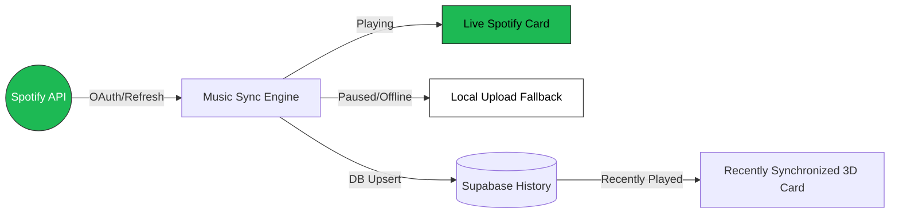
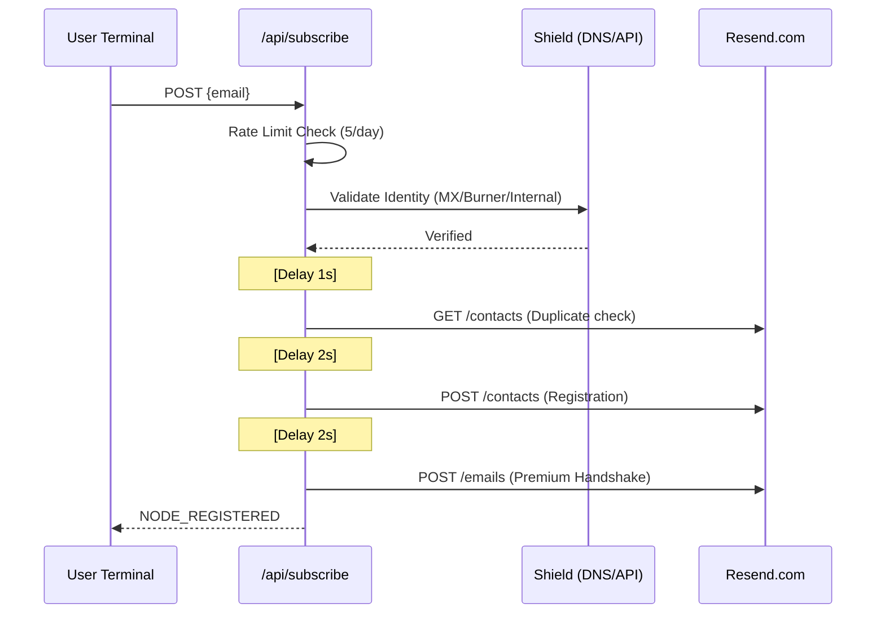
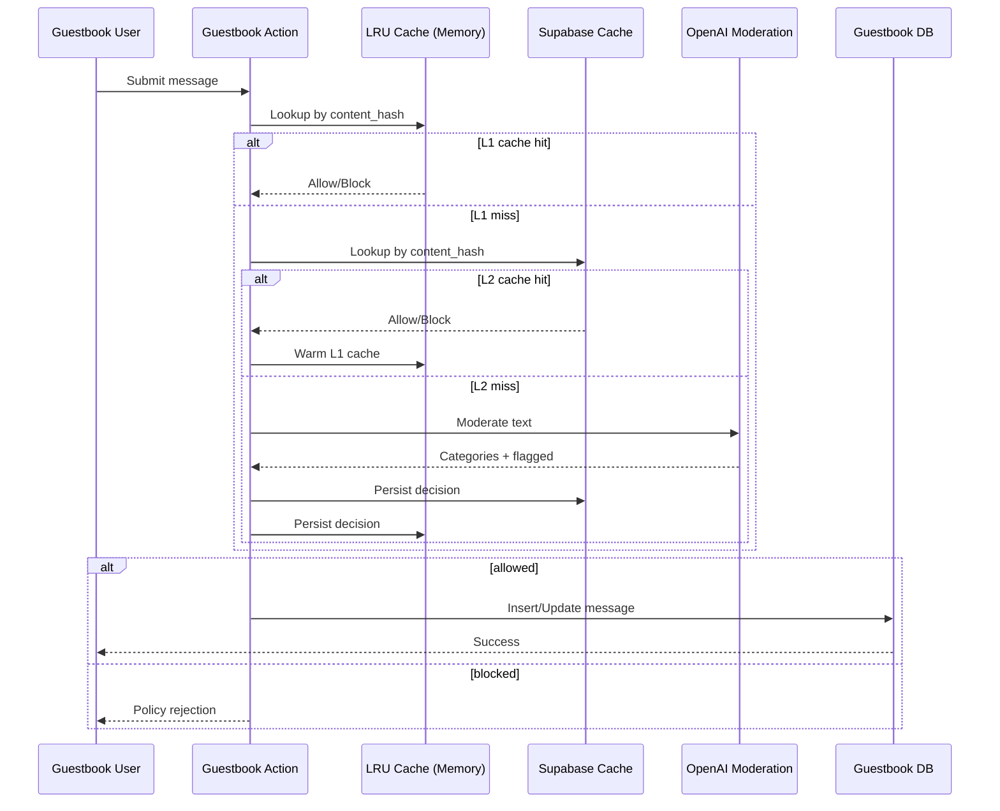

# avrxt | Full-Stack Infrastructure & Personal Engine


A high-performance, premium personal website and service platform built with **Next.js 15+**, **Supabase**, **Tailwind CSS 4**, and **Vercel Analytics**. Designed for speed, security, scalability, and absolute control.

---

## 🏗️ System Architecture



---

## 🚀 Key Features

### 🎯 Core Pages & Functionality

- **Landing Page (`/`)**: High-impact hero section with glassmorphism, tech stack matrices, and production metrics.

- **Profile Node (`/me`)**: Immersive "Link in Bio" ecosystem with **Real-Time Spotify Synchronization**, 3D recently played cards, and newsletter terminal.

- **Technical Library (`/docs`)**: Markdown-powered documentation system with professional SEO and admin controls.

- **Interaction Hub (`/guestbook`)**: Verified community messaging system via GitHub OAuth with layered moderation controls.

- **Project Intake (`/hireme`)**: Advanced budget/timeline estimator for service inquiries.

### ☁️ Cloudflare R2 Integration (New)

- **High-Resolution Pipeline**: Direct client-to-cloud uploads via **S3 Presigned URLs**, bypassing Vercel's 4.5MB limit.

- **Dynamic Asset Sync**: Automated deletion of old files when replacing profile pictures, banners, or music tracks.

- **CDN Segmentation**: Intelligent routing to `i.cdn.avrxt.in` (images) and `v.cdn.avrxt.in` (media).

- **Hard-Purge Logic**: Immediate cloud deletion when removing items from the visual gallery.

### 🎵 Music Synchronization Engine

- **Live_Spotify Protocol**: Real-time polling of Spotify playback status with dynamic progress bars.

- **Intelligent Dual-Buffer**: Automatic transition between Live Spotify and local Uploaded Music frequency when offline.

- **Recently_Synchronized 3D Cards**: Historical playback memory with "Last Seen" timestamps and immersive 3D hover interactions.

- **Visual Flow Bars**: Premium CSS-animated gradient flow on all music progress indicators.



### 📧 Newsletter & Mail Protocol (v3)

A hardened, internal mailing engine replaces the previous proxy-based implementation.

- **Micro-Staggered Handshake**: To respect Resend's free-tier rate limits (2 req/sec), the system implements a sequential throttle (1s + 2s + 2s) between List, Create, and Send operations.

- **Shield Protocol (Spam Defense)**:

  - **Internal Blocklist**: Prevents `avrxt.in`, `avrxt.space`, and `aviorxt.aero` from internal spamming.

  - **Burner Detection**: Integrated **Mailcheck.ai** and local blacklists to block temporary/throwaway email providers.

  - **DNS MX Validation**: Technical DNS handshake to verify mailbox existence before processing.

- **Direct-to-Core API**: Communications now flow through `/api/subscribe`, eliminating external "Link Lost" errors.



### Guestbook Safety & Moderation (v4 core)

- **OpenAI Moderation Gate**: Every guestbook post/edit is screened before DB write.

- **Protected Categories**: Hate speech, harassment, sexual content, violence, self-harm, and toxic language.

- **Dual Cache Strategy**:

  - **L1 Memory Cache (LRU)**: Fast in-process decision cache for repeat messages.

  - **L2 Supabase Cache (Persistent)**: Shared moderation memory across restarts/deployments.

- **Fail-Closed Behavior**: If moderation service is unavailable or not configured, unsafe bypass is blocked by default.

- **Auditability**: Cached decisions track reasons, model, hit count, and last seen timestamp.



### ☁️ Cloud Engineering (`/cloud`)

Premium tier-based service architecture for:

- **Discord Bot Development**: Moderation, AI Dashboards, and Custom Neural Architectures.

- **Website Re-Design**: UI/UX overhauls and performance refactoring.

- **Infrastructure Maintenance**: 24/7 monitoring and security hardening.

### 🔐 Security & Privacy (Harden Layer)

- **Zero-Index Protocol**: Admin endpoints and sensitive success routes are hardcoded with `robots: { index: false }` and disallowed via `robots.ts`.

- **Infrastructure Hardening**: Enforced TLS 1.3, CSP headers, and Cloudflare WAF protection.

- **Data Governance**: Full compliance with **DPDP Act 2023** and **GDPR**.

- **Secure Payments**: 256-bit SSL encrypted Razorpay integration with automated non-refundability notices.

### 📈 Pro-Level SEO

- **Dynamic Sitemap**: Automatically generated `sitemap.ts` that crawls base routes and dynamic Cloud services.

- **Metadata Objects**: Server-side metadata injection for high-fidelity social sharing and search ranking.

- **Dynamic Robots**: Programmatic `robots.ts` to manage search engine crawl budget efficiently.

---

## 🛠️ Technology Stack

| Layer | Technologies |

|--- |--- |

| **Frontend** | Next.js 16+, React 19, Tailwind CSS 4, Lucide |

| **Backend** | Next.js API Routes, Server Actions |

| **Mailing** | Resend SDK (Staggered Protocol) |

| **Security** | OpenAI Moderation API, Mailcheck.ai, DNS MX Lookup, LRU Cache |

| **Database** | Supabase (PostgreSQL), Realtime |

| **Storage** | Cloudflare R2 (S3 Compatible) |

| **Auth** | Supabase Auth, GitHub OAuth |

| **Communications** | Resend API, Google Sheets API |

| **Payments** | Razorpay SDK |

| **CDN** | Cloudflare Global Edge |

| **Observability** | Vercel Analytics, Vercel Speed Insights |

---

## 🏗️ Project Structure

```bash

src/

├── app/

│   ├── api/

│   │   ├── subscribe/     # Hardened Newsletter API Node (New)

│   ├── actions/           # Secured Server Actions (Cloud, Cupcake, Docs)

│   ├── cloud/          # Cloud services & payment infrastructure

│   ├── me/                # Personalized profile & bio terminal

│   ├── robots.ts       # Dynamic Robots configuration

│   ├── sitemap.ts      # Dynamic Sitemap generator

│   ├── subscribe/         # Premium Frontend Node

├── components/         # Premium UI Components (Reveal, Spotlight, etc.)

├── lib/               # Shared logic & Supabase client

└── utils/             # Helper functions & constants

```

---

## ⚙️ Setup & Deployment

1. **Clone & Install**:

   ```bash

   git clone https://github.com/avrxtcloud/avrxt-in.git

   npm install

   ```

2. **Environment**: Configure `.env.local` with Supabase, Resend, Razorpay, and Google Service Account credentials.

3. **Guestbook Moderation (Required for v4 core)**:
   - Add environment variables:
     - `OPENAI_API_KEY` (required)
     - `OPENAI_MODERATION_MODEL` (optional, default: `omni-moderation-latest`)
     - `SUPABASE_SERVICE_ROLE_KEY` (required for persistent moderation cache)
   - Run SQL migration in Supabase:
     - `supabase/migrations/20260307_guestbook_moderation_cache.sql`
   - This creates `public.guestbook_moderation_cache` used for permanent moderation memory.

4. **Deploy**: Optimized for Vercel with automatic CI/CD on `main` and `development` branches.

---

## 🎨 Design Philosophy

The system follows a **"Dark Mesh"** design language:

- **Performance**: Sub-second LCP (Largest Contentful Paint).

- **Aesthetics**: Glassmorphism, blurred backdrop filters, and typography-driven layouts.

- **Responsiveness**: Fluid scaling from 320px to 4K displays.

---

## 📝 Fixes & Updates Log

### [March 7, 2026] - Guestbook Moderation v4 Core
- **NEW**: Added OpenAI Moderation enforcement for guestbook `post` and `edit` flows.
- **NEW**: Added dual-layer moderation cache (in-memory LRU + persistent Supabase cache).
- **NEW**: Added migration for `guestbook_moderation_cache` with RLS enabled:
  - `supabase/migrations/20260307_guestbook_moderation_cache.sql`
- **UPDATE NOTE**: Guestbook moderation reference implementation:
  - `src/lib/guestbook-moderation.ts`
  - `src/app/actions/guestbook.ts`

### [March 7, 2026] - Security Hardening v4 & Payment Integrity Patch
- **CRITICAL FIX**: Removed client-side trust for cloud pricing by validating `serviceId + variantId` server-side before Razorpay order creation.
- **CRITICAL FIX**: Added strict payment verification against Razorpay `order.amount` and `payment.order_id` before marking bookings as paid.
- **FIX**: Repaired "Price on Request" flow with dedicated lead capture path for non-paid tiers (no fake signature path).
- **FIX**: Hardened Spotify OAuth with admin-gated access plus CSRF `state` cookie validation on auth callback.
- **FIX**: Patched auth callback redirect handling by sanitizing `next` path to prevent open redirect misuse.
- **FIX**: Escaped user-supplied HTML content in contact/hireme mail templates and improved email validation.
- **FIX**: Improved anti-abuse behavior on `/api/subscribe` with normalized client IP extraction and scoped CORS origin handling.
- **FIX**: Switched Supabase admin client to fail-fast mode when service role credentials are missing.
- **UPDATE**: Upgraded Next.js stack to `16.1.6` and resolved all known npm audit vulnerabilities.
- **UPDATE**: Lint/build/audit pipeline now passes cleanly after v4 remediation.
### [March 4, 2026] - Mail Core v3 & Status v2

- **FIX**: Resolved "Uplink Lost" errors by implementing local `/api/subscribe`.

- **FIX**: Resolved build-time crashes caused by top-level `Resend` instantiation across `actions/`.

- **NEW**: Implemented **Glory at avrxt.in** custom branding for all transactional emails.

- **NEW**: Added **Shield Protocol** (MX lookup + Blacklisting) to save on mailing costs.

- **NEW**: Implemented **Staggered API Calls** to mitigate Resend 429 rate limits.

- **NEW**: Redesigned **Betterstack Status Badge** with a premium, animated React component mapping to the site's dark design system.

---

## 📝 License & Contact

**PROPRIETARY & CONFIDENTIAL**  

Copyright © 2026 **@avrxt**. All rights reserved.

⚠️ **LEGAL NOTICE**: Any unauthorized usage or duplication of this project will lead to immediate **legal action**.

**Developer**: [@avrxt](https://instagram.com/aviorxt) | [support@avrxt.in](mailto:support@avrxt.in)

*Last Updated: March 7, 2026 by Vipin R*
