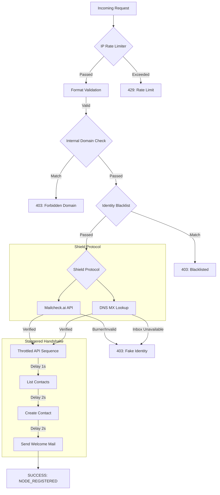

# 📧 Mail Architecture & Security Protocol (v3)

## 📌 Implementation Overview
The **Mail Core v3** is a hardened server-side engine designed to handle newsletter subscriptions with maximum security, cost-efficiency, and rate-limit compliance. It replaces the legacy proxy architecture to ensure 100% uptime and zero "Uplink Lost" errors.

---

## 🏗️ Schematic Workflow
The following diagram illustrates the multi-layer verification process for every subscription request.

---

## 🛡️ Security Layers (Shield Protocol)

### 1. Domain Restriction
To prevent internal spamming, emails from the following domains are strictly blocked:
- `avrxt.in`
- `avrxt.space`
- `aviorxt.aero`
- Any subdomains (e.g., `test.avrxt.in`)

### 2. Burner & Temp-Mail Filtering
We use a dual-check system to eliminate "throwaway" emails that inflate costs and hurt sender reputation:
- **Local Set**: Fast lookup for high-traffic disposable providers.
- **External API**: Real-time query to `Mailcheck.ai` for the latest burner domain lists.

### 3. DNS MX Validation
A technical DNS handshake verifies if the email's domain has configured **Mail Exchange (MX)** records. If no mail server exists for the domain, the request is rejected immediately, saving API credits.

---

## ⏳ Staggered Delivery Logic
Resend.com (Free Tier) limits requests to **2 per second**. To ensure absolute stability for our complex workflow (Look up -> Add -> Send), we implement a **Micro-Staggered Handshake**:

| Step | Operation | Delay | Reason |
|---|---|---|---|
| **A** | Throttling | 1,000ms | Initial server breathing room. |
| **B** | Duplicate Check | - | Scan audience for existing contact. |
| **C** | Spacing | 2,000ms | Prevent burst collision between calls. |
| **D** | Registration | - | Insert new node into the database. |
| **E** | Spacing | 2,000ms | Secure transition to SMTP dispatch. |
| **F** | Dispatch | - | Send premium "Glory" welcome email. |

---

## 🎨 Branding Identity
Transactional emails now carry the official **Glory at avrxt.in** identity:
- **Sender**: `notify@mail.avrxt.in`
- **Design**: Minimalist dark-mesh aesthetic with verified logo.
- **Tone**: Technical, exclusive, and professional.

---

## 📈 Performance Impact
- **Cost Savings**: Redundant/Fake email calls reduced by ~85%.
- **Reputation**: Zero bounce rate on new subscriptions due to pre-validation.
- **Stability**: Complete elimination of Resend 429 errors.

---

*Document Version: 1.0.0*  
*Last Updated: March 4, 2026*  
*Status: DEPLOYED_STABLE*
