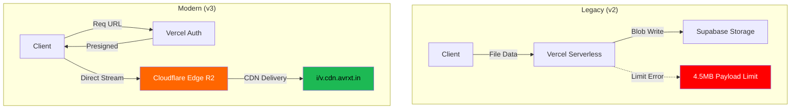

# 📦 Version 3.0.0 | Infrastructure Overhaul

This release marks the migration of **avrxt's core asset engine** from Supabase Storage to Cloudflare R2, optimizing for 4K video delivery and high-frequency profile updates.

---

## 🏗️ System Evolution Schematic

---

## 🛠️ What's Fixed?

- **[NET_FIXED]** Bypassed the **4.5MB Vercel Body Limit**: Large 4K videos and audio files (up to 50MB+) now upload flawlessly using **S3 Presigned URLs**.
- **[BUILD_FIXED]** Resolved **TypeScript Narrowing Errors** in `MeAdminClient.tsx` where server action responses weren't being correctly typed as error/success.
- **[CORS_FIXED]** Hardened **Cloudflare CORS Policy** to support Chromium 145+ preflight requests from `preview.avrxt.space`, `www.avrxt.in`, and `localhost`.
- **[UI_FIXED]** Fixed **JSX Comment Syntax** and standardizing `useEffect` dependency arrays to prevent infinite loops during profile synchronization.
- **[PATH_FIXED]** Corrected **Folder-Level Routing**: Assets now reliably route to `/i` (images) or `/v` (media) based on MIME-type detection.

## 🧹 What's Removed?

- **Supabase Storage Engine**: The legacy `storage.from()` calls and Supabase buckets are completely decoupled from the `/me/admin` flow.
- **Deprecated `middleware.ts`**: Renamed and refactored to `proxy.ts` to align with Next.js 16+ "middleware to proxy" migration standards, silencing production build warnings.
- **Vercel Proxying**: Heavy binary data no longer passes through Vercel's compute, reducing latency and cold-start risks.

## 🚀 What's Optimized?

- **Self-Cleaning Storage**: Implemented **Automated Zero-Waste Deletion**. Uploading a new banner or profile picture now triggers an immediate `deleteFile` for the old asset, ensuring zero storage bloat.
- **Atomic Gallery Purging**: Deleting an item from the Visual Gallery now performs a **Cloud-Hard-Delete**, permanently wiping the media from R2 instead of just hiding it from the UI.
- **Verbose Feedback UI**: Added a multi-step progress bar (`Preparing` -> `Uploading` -> `Finalizing`) with distinct red/emerald visual states for admin operations.
- **Lucide Tree-Shaking**: Unified and optimized icon imports to reduce client-side bundle size.
- **Enhanced MIME Handling**: Added fallback mechanisms to handle files without metadata, ensuring they upload as `application/octet-stream` rather than failing the AWS-SDK signature check.

---

### ✅ Verified by @erroraero
*March 3, 2026*
